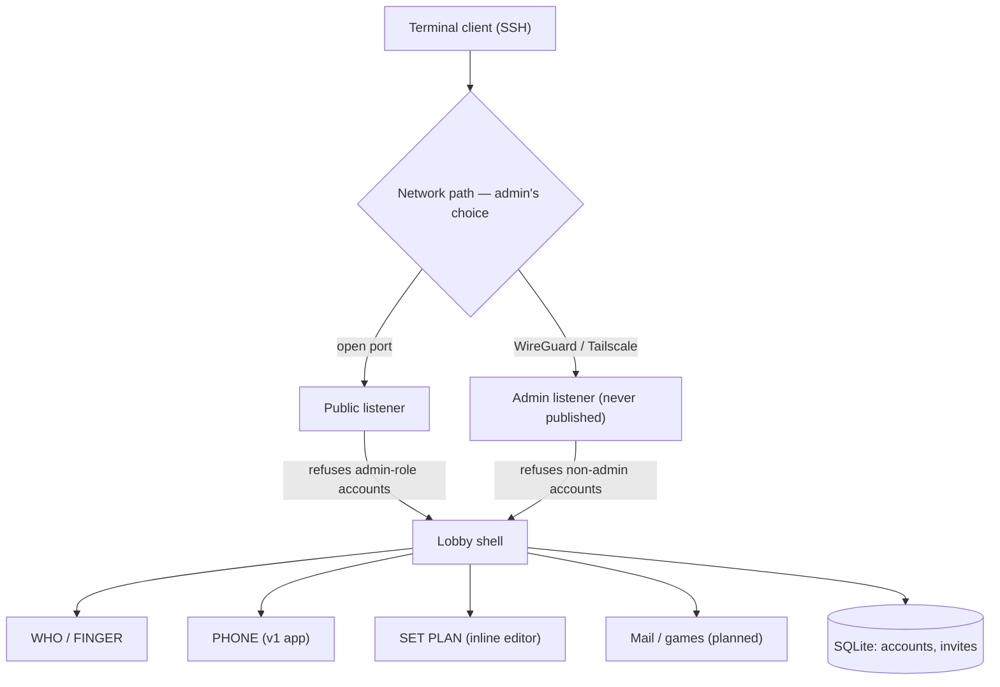
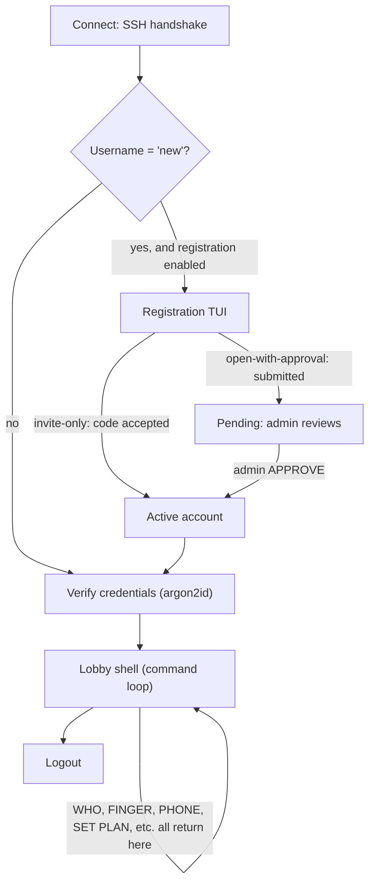
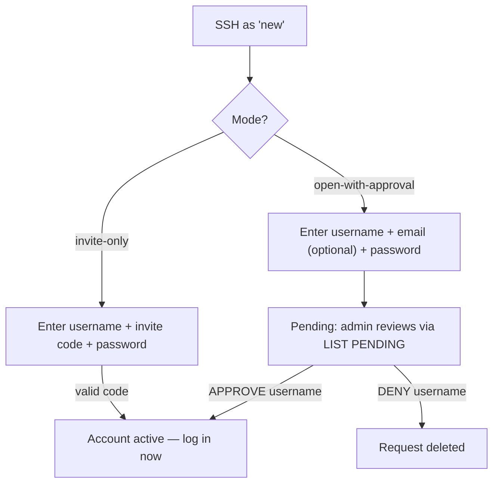

# Retro VAX-BBS — Design Doc

A modern, self-hosted, retro VAX/VMS-style multi-user environment. Not a replacement for `talk`/`ytalk` — those already exist. This is a closed-world shell environment in the spirit of early-90s campus VAX/VMS, with **PHONE** (real-time multi-party chat, à la the original VAX/VMS PHONE utility) as the flagship first app, built on a modular framework that can host future apps (mail, a text game, etc.).

> **Naming note:** this project is an independent, non-commercial hobby homage to VAX/VMS terminal culture. It is not affiliated with, endorsed by, or representing VMS Software, Inc. (VSI) or Hewlett Packard Enterprise (HPE), who develop and support the actively-maintained OpenVMS operating system today. See the README for the full disclaimer.

Designed with eventual public/community release in mind (stretch goal: Unraid Community Apps), so the architecture supports multiple deployment risk postures rather than assuming one trusted environment.

---

## Core design principles

1. **Closed command grammar.** User input can only ever resolve to a fixed set of pre-compiled, admin-approved command handlers. There is no `exec`, `eval`, or scripting hook anywhere in the path from user input to execution. This is a structural property of the architecture, not a runtime check — there is no path to a real OS shell to "break out" into.
2. **Per-session crash isolation.** Every command handler runs under `recover()`, so a bug or malicious input in one handler can't take down the server or anyone else's session.
3. **Secure by default, regardless of deployment.** Rate limiting and account lockout are always on, whether the operator runs this behind a VPN or on an open port.
4. **Network exposure and identity verification are orthogonal.** How the admin secures the network (WireGuard, Tailscale, open port) is entirely their call and irrelevant to the app. Registration mode and the admin/public listener split are the app-level controls.

---

## Tech stack

- **Go**, using Charm's **`wish`** (SSH application framework) + **`bubbletea`** (TUI) + **`lipgloss`** (styling) + **`bubbles`** (UI components).
- **SQLite** for persistence (accounts, invites) — single-binary friendly, no external DB dependency.

**Why this stack:**
- Bubble Tea consumes terminal resize events (`WindowSizeMsg`) natively — the thing that broke on the original VAX terminals is a solved problem here.
- SSH gives encrypted transport for free, without hand-rolled crypto.
- Go compiles to a single static binary → trivial, tiny Docker image → clean Unraid template later.
- Alternative considered: Python + `asyncio` + `Textual` — also viable, not chosen, worth revisiting only if Go proves too steep a climb.

---

## Architecture overview



**Two SSH listeners, symmetric partition by account role:**
- **Public listener** — whatever port the admin chooses to expose. Accepts connection attempts from anyone, but **flatly refuses authentication for any admin-role account**, before even checking the password. Same generic "invalid credentials" message either way — an attacker can never tell whether they guessed an admin password correctly, because right-password-wrong-listener and wrong-password look identical.
- **Admin listener** — never published to the internet. Reachable only via the admin's own VPN tunnel (WireGuard/Tailscale/etc. — entirely the admin's setup, outside the app's concern). Refuses authentication for any non-admin account, mirroring the public listener.

This is enforced by **network binding**, not by app-layer IP/CIDR string-matching — more robust, can't be fooled by misidentified client IPs behind a proxy, and maps cleanly onto how Unraid users already think about which container ports to publish.

*(A CIDR-allowlist approach — app checks connecting IP against an allowed range, downgrades to non-admin if it doesn't match — was considered as a lighter-weight alternative or a defense-in-depth complement, but the listener split is the primary, simpler mechanism.)*

---

## Session lifecycle



The lobby is a closed loop. Every command — including launching an "app" like PHONE or the SET PLAN editor — runs and then returns control to the lobby. Nothing exits sideways into a real shell.

---

## Modular app interface

Apps (PHONE first, mail and a text game planned) implement a common lifecycle contract, mirroring Bubble Tea's own model interface (init / update / render). The lobby pushes an app onto the screen when its command is typed; the app owns the screen until it exits; control returns to the lobby. Getting this interface contract right early matters more than how many apps exist on day one — it's what makes future apps cheap to add without touching lobby code.

The `app.App` interface extends `tea.Model` with a `Done() bool` method:

```go
type App interface {
    tea.Model // Init() tea.Cmd, Update(tea.Msg) (tea.Model, tea.Cmd), View() string
    Done() bool
}
```

Apps whose internal Update returns a concrete type (e.g. `setplan.Model`, `createuser.Model`) use a thin `AppAdapter` wrapper to satisfy the interface without coupling packages — see `internal/setplan/app.go` and `internal/createuser/app.go`. The lobby recognizes an app's one-shot result message via a small `statusReporter` interface (`StatusMsg() string`), rather than a type switch per app — so adding a new inline app doesn't require touching lobby code.

---

## Account & registration

**Registration mode is a deploy-time config choice** (`REGISTRATION_MODE` env var), not hardcoded — supports different operator risk tolerances:
- `closed` (default) — no self-service at all. The admin provisions every account directly, either in-lobby via `CREATE USER <username> [role]` (masked password prompt, no plaintext ever touches the command line or scrollback) or, for the very first account / scripted setup, via the `cmd/adduser` CLI.
- `invite-only` — user SSHs in as `new`, enters a username, invite code, and password; account activates immediately
- `open-with-approval` — user SSHs in as `new`, submits a request (username, optional email, password); admin manually approves

**Registration flow:**



- **Invite codes:** short and human-typeable (`adjective-noun-NN` format, e.g. `swift-oak-42`), generated with `crypto/rand`, multi-use, optionally expiring. Generated via `INVITE CREATE [N] [duration]`; listed via `LIST INVITES`.
- **Password set during registration**, not deferred to first login. Same rule for admin-created accounts (`CREATE USER`) — the password is captured through a masked prompt at creation time, never as a plaintext command argument.
- **Pending accounts auto-expire** after `PENDING_EXPIRY_DAYS` (default 7 days) to prevent username squatting. Admins can also `DENY` or `DELETE USER` immediately to free a name.
- Existing account → password (argon2id) or registered SSH public key.
- **SSH key upgrade (optional, opt-in):** `SET KEY` registers a public key against an account; future connections skip the password prompt entirely if the key matches. Off by default, available to anyone who wants it.

---

## Auth & credential security

- **Argon2id** password hashing. Rough starting params: ~64MB memory, 3 iterations — tune against actual deployment hardware later.
- **Per-account lockout** after 5 failed attempts; admin `UNLOCK` clears it early.
- **Per-IP connection/attempt rate limiting baked into the app itself** — self-contained, works identically regardless of deployment (Docker, bare metal, behind VPN, open port). Doesn't depend on host-level tooling.
- **fail2ban / OS-level firewall banning is optional, documented, not required.** The app speaks SSH directly (via `wish`), so there's no standard `sshd` auth log for fail2ban to read out of the box — an operator who wants that layer needs a custom filter pointed at the app's own structured log output. The app logs each auth failure (timestamp, source IP, attempted username) specifically so that path stays easy to bolt on.
- **No username enumeration** — auth failure messages are always generic, regardless of which part (username or password) was actually wrong.

---

## Admin model

- **Admin accounts are separate accounts from daily-use accounts** — not a role flag toggled on someone's everyday account. Least-privilege by construction.
- **Enforcement is the dual-listener split** (see Architecture) — structural, not app-logic IP matching.
- **Admin accounts are invisible by default** in both `WHO` (the browsable list) and `FINGER <user>` (a direct, targeted lookup) — hiding only from `WHO` and not `FINGER` would leak existence the moment someone guesses/knows the username, so both are covered.
  - **Exception:** admins are always visible to other admins.
  - **Opt-in:** an individual admin account can run `SET VISIBLE` to be discoverable (e.g., a sysop who wants people to know they're around to help). Not the typical case.
- **All state-changing admin actions are logged** with the real account name — `APPROVE`, `DENY`, `KICK`, `BAN`, `UNBAN`, `UNLOCK`, `DELETE USER`, `CREATE USER`, `RESET PASSWORD`, `EXPIRE PASSWORD`, `INVITE CREATE`, `PURGE PENDING` — regardless of that account's visibility setting. Invisibility is about presence-browsing for regular users, not about accountability. Read-only admin commands (`LIST PENDING`, `LIST USERS`, `LIST INVITES`) are gated but not logged — no state changes, nothing to audit.
  - **Where it's enforced:** `internal/lobby/commands.go`'s `requireAdminLogged` helper, called by every mutating admin handler in place of the plain `requireAdmin` gate. It's the same chokepoint each handler already needs for the security check itself, so the audit line can't be skipped without also skipping the access check. It logs the *attempt* (admin ran command X with these arguments), not a confirmed-successful mutation — several handlers return plain English on success with no machine-checkable marker, so "an admin ran this" is the reliable signal, same spirit as logging auth failures rather than only auth successes.
  - **Exception:** `CREATE USER` and `RESET PASSWORD` are two-phase — each only launches a masked password prompt (`internal/createuser`, `internal/setpassword`); the admin can still cancel it. `requireAdminLogged` logs that the command was invoked, and the sub-app's `finalise()`/cancel path logs the actual outcome (created or set / cancelled / failed) once known.
- **Admin commands are invisible to non-admins, not just access-denied.** A regular user typing `BAN`, `BAN alice 1h`, or `LIST PENDING` gets the exact same `"BAN" is not a recognized command` response a typo would get — not a distinct "access denied" message, and not the command's usage text (several admin commands used to show usage with no role check at all when typed with no arguments). `dispatch()` checks a role-gated set of canonical command keys, derived from `adminHelpTopics`, before ever calling a handler — same single-source-of-truth pattern as `requireAdminLogged` above, so a new admin command added to `adminHelpTopics` is automatically hidden from non-admins without a second list to maintain. This sits in front of, not instead of, each handler's own `requireAdmin`/`requireAdminLogged` check. Lower-stakes than the auth/account-visibility enumeration protections above, since the source is headed for eventual public release (see Deployment model) and command names aren't secret — this is about not tipping your hand in the terminal, not about hiding what the codebase does.

---

## Roles & account states

- **Roles:** `user`, `admin`
- **States:** `pending`, `active`, `suspended`

---

## Schema (SQLite)

```sql
users (
  id INTEGER PRIMARY KEY,
  username TEXT UNIQUE NOT NULL,
  password_hash TEXT,              -- set during registration
  ssh_pubkey TEXT,                  -- null until SET KEY
  email TEXT,                       -- optional; used for open-with-approval
  status TEXT NOT NULL,             -- pending | active | suspended
  role TEXT NOT NULL DEFAULT 'user',
  plan_text TEXT,                   -- FINGER profile blurb; set via SET PLAN
  color_opt_in BOOLEAN DEFAULT 0,
  admin_visible BOOLEAN DEFAULT 0,  -- only meaningful when role = 'admin'
  failed_attempts INTEGER DEFAULT 0,
  locked_until DATETIME,
  banned_until DATETIME,            -- NULL = not banned; year 2099 = permanent
  must_change_password BOOLEAN DEFAULT 0, -- set by admin EXPIRE PASSWORD
  created_at DATETIME,
  last_login_at DATETIME
);

invites (
  code TEXT PRIMARY KEY,
  created_by INTEGER REFERENCES users(id),
  uses_remaining INTEGER,
  expires_at DATETIME               -- year 2099 = no expiry
);
```

Schema migrations run automatically at startup using `ALTER TABLE ADD COLUMN` (additive only, idempotent).

---

## v1 command set (lobby)

**User commands:** `HELP`, `WHO` / `SHOW USERS`, `FINGER <user>` / `SHOW USER <user>`, `TIME` / `SHOW TIME`, `PHONE` / `PHONE <user>` / `DIAL <user>`, `SET PLAN`, `SET PLAN CLEAR`, `SET PASSWORD`, `LOGOUT`.

**Admin-only commands:** `LIST PENDING`, `LIST USERS`, `LIST INVITES`, `APPROVE <user>`, `DENY <user>`, `DELETE USER <user>`, `CREATE USER <username> [role]`, `KICK <user>`, `BAN <user> <duration>`, `UNBAN <user>`, `UNLOCK <user>`, `RESET PASSWORD <user>`, `EXPIRE PASSWORD <user>`, `INVITE CREATE [N] [duration]`, `PURGE PENDING`.

**Planned user commands:** `SET KEY` (SSH public key), `SET COLOR` (opt-in color), `SET VISIBLE` (admin visibility opt-in).

**Nice-to-have, low effort:** VAX/VMS-style command abbreviation — typing the shortest unambiguous prefix of a command works, just like classic DCL.

---

## PHONE — the v1 flagship app

- Verbs mirror the original: `DIAL`, `ANSWER`, `HANGUP`, `ADD` (multi-party).
- Split-pane, character-echo live chat — robust to terminal resize via Bubble Tea's `WindowSizeMsg`.
- Multi-party from the start: `ADD <username>` adds participants to an active call; viewport layout divides screen height among N participants.
- **Color/emphasis (future, not v1):** opt-in on both ends — renders only if the sender opted in to send it *and* the receiver opted in to receive it. Never breaks the experience of someone who hasn't opted in.

### Call admission — one predicate, both entry points

`DIAL` and `ADD` are the only two ways to start a ring, and both route through a
single `admitLocked` predicate in `internal/phone/call.go`. A ring is refused if
the target is yourself (`%PHONE-E-SELF`), not connected (`%PHONE-E-NOLOGIN`),
already in a call — pending or active (`%PHONE-E-BUSY`), or already being rung by
anyone (`%PHONE-E-BUSY`). **One ring per callee at a time, with no per-call
exception.**

The predicate is deliberately at the `Calls` chokepoint rather than in the
handlers. `DIAL` while already in a call is an alias for `ADD` (matching real
VAX/VMS, which let DIAL pull someone into an in-progress conversation), and when
the busy rule lived only on `Dial` that alias silently bypassed it — a
participant of one call could ring a participant of another, who could then
neither answer nor reject. Rules at the chokepoint mean a new caller inherits
them instead of re-forgetting them. Same reasoning as `usableAdminPredicate` in
`internal/store` (see Admin model).

**Separate calls are never merged.** Refusing a busy target is the whole design:
the original VAX/VMS PHONE had no notion of joining two live conversations, and
`ADD` builds a conference from *one* call outward rather than splicing two
together.

**The invariant is one call per _session_, not one per account.** Two sessions of
one account can each hold their own independent live call, and this is a working
feature — driven end-to-end over real SSH, not merely permitted by a predicate.
(It was admission-only until `74a2ef5`; the earlier wording in this document said
so explicitly, and finding 11 of
`docs/audits/audit-2026-07-13-phone-call-admission.md` records why.)

**Presence is per-account; event delivery is per-session.** The registry splits
into an `entry` per account — role, admin visibility, the WHO/FINGER app label,
the KICK hook — and a `sessionState` per session, each owning its **own** notify
and done channels. That split is the whole fix: `notify` is a single-consumer
queue, so one channel shared by an account's sessions meant every control event
was raced for and consumed by exactly one of them, at random. Sessions are
identified by an opaque monotonic ID minted at `Register` and threaded
middleware → context → lobby → PHONE → `Participant.SessionID`, so a call
membership is a *session's*, not an account's.

**Admission is deliberately asymmetric, and the asymmetry is load-bearing:**

- **Being-rung is account-level.** One ring per callee at a time, from any call,
  with no per-call exception. This is what keeps audit findings 4 and 8 closed:
  because a second concurrent dial to a callee is refused at admission, at most
  one pending `Call{Callee: x}` can exist, so a ring's per-session fan-out can
  never overlap a second ring and clobber each session's single
  `pendingIncomingCallID`.
- **Busy is per-session.** A callee is busy only when *every* one of their
  sessions is already in a call; if any session is idle, the ring is admitted and
  fans out to the idle ones.
- **The caller's own membership is still never consulted** — not an oversight. A
  `Dial` structurally only ever originates from an idle session, because an
  in-call DIAL routes to `Add` instead. One-call-per-session therefore holds on
  the caller side without a check. The flip side remains that one account cannot
  phone itself.

**Ring fan-out is first-answer-wins.** An incoming call rings every idle session
of the callee account. The first to answer goes active; the rest have their rings
retracted with `EventAnswerElsewhere` — a distinct type, *not* `EventHangup`,
though the payload is otherwise identical. The distinction is purely so the losing
sessions can say "answered on another session" instead of falsely reporting that
the caller cancelled, at a moment when the caller is in fact talking to the
account's other session. A second session racing an `ANSWER` in after the call is
already active is refused at the `Calls` chokepoint with `ErrAlreadyAnswered`, so
first-answer-wins is enforced by the call layer rather than by UI timing.

**Finding 10 ("one user, one call" assumed but never enforced) is retired** — it
was a policy question, and this design answers it: the enforced unit is the
session, and an account may hold as many concurrent calls as it has sessions.

---

## SET PLAN — inline profile editor

Users set their FINGER blurb with `SET PLAN`, which launches an inline
`bubbles/textarea` editor (Ctrl+S to save, Esc to cancel). `SET PLAN CLEAR`
removes the blurb immediately without opening the editor.

Plan text is stored in the `plan_text` column and displayed by `FINGER`.
ANSI escape sequences are stripped at both storage and display time —
structural protection against terminal injection, not a runtime filter.
Character limit: 512 runes.

---

## CREATE USER — in-lobby account provisioning

Admins create accounts directly from the lobby with `CREATE USER <username>
[role]` (role defaults to `user`), instead of dropping to a shell for
`cmd/adduser`. Username and role are validated and checked for uniqueness
immediately; the command then launches a small inline app (same pattern as
SET PLAN) that prompts for a masked password and confirmation.

The password never appears as a command-line argument and is never written
to the lobby's scrollback history — both because lobby command lines are
echoed verbatim into `history` for `PgUp`/`PgDn` scrollback, and because SSH
clients echo typed input in the clear unless the application itself masks
it. `cmd/adduser` remains the only way to create the very first account
(there's no admin session yet to run a lobby command from) and is still
useful for scripted/headless provisioning.

---

## SET PASSWORD / RESET PASSWORD / EXPIRE PASSWORD — password management

Three commands, one shared flow (`internal/setpassword`), covering the
self-service, admin-assisted, and admin-forced cases:

- **`SET PASSWORD`** (any user, self-service) asks for the caller's
  *current* password before the new one — protection against an
  unattended SSH session being used to lock out the real account owner.
  A wrong current password counts against the same 5-attempt lockout
  counter as login (`RecordFailedAttempt`/`ClearFailedAttempts`), so it
  has real teeth rather than being an unlimited-guess side channel.
- **`RESET PASSWORD <username>`** (admin) sets a user's password
  directly — the normal path for password-reset requests or recovering a
  forgotten admin password, superseding the old raw-SQL emergency
  procedure. No current-password check (the admin doesn't know it).
  Two-phase audit logging, same pattern as `CREATE USER`: dispatch logs
  the invocation, the sub-app's `finalise()` logs the outcome, since the
  admin can still cancel the password prompt.
- **`EXPIRE PASSWORD <username>`** (admin) sets `must_change_password`;
  the user's current password still works for their *next* login, but
  that session is routed straight into a mandatory password-change
  screen before the lobby loads — not a dismissable nag. Esc does
  nothing there; only Ctrl+C disconnects, leaving the flag set for next
  time.

**Why `RESET PASSWORD` and not `SET PASSWORD <username>`:** the lobby's
admin-visibility gate (`dispatch()`'s `adminCommandKeys`, see Admin model
above) hides admin commands from non-admins by checking the dispatch key
itself — for a prefix command like `SET PASSWORD <username>`, that key
would be the literal string `"SET PASSWORD"`, identical to the bare
self-service command's own dispatch key. Gating one would gate both,
hiding self-service password change from everyone. Using a distinct verb
for the admin-targeted case avoids the collision without teaching the one
security chokepoint the whole admin-visibility model relies on being
uniform to special-case a single command.

**Why `EXPIRE PASSWORD` ends in "reconnect," not a seamless hand-off:**
this codebase builds exactly one `tea.Program` per SSH session
(`cmd/server/main.go`'s `teaHandler`, via wish's `bm.Middleware`); there's
no mechanism to swap the root Bubble Tea model mid-session.
`internal/registration` hits the identical constraint for a freshly
activated account, and follows the same precedent: show a success
message, then quit and require a fresh connection.

---

## Deployment model

- **One codebase, one Docker image** — no separate "VPN version" vs. "open version."
- Admin chooses network exposure entirely independently of app config (registration mode + admin listener binding are the actual security knobs).
- **Stretch goal:** Unraid Community Apps template.
- Public-release readiness was a design input from the start — the registration-mode config and the admin-listener split are what make an open-port deployment defensible, not a fork of the codebase.

---

## Deferred / future features (explicitly not v1)

- Mail app (uses the modular app interface)
- Text adventure game (uses the modular app interface)
- ASCII color/emphasis terminal options (see PHONE section above — opt-in both ends, always optional)
- External notification hooks (webhook/ntfy-style "X is online" pings) — subscribe model, opt-in; reserve the hook point in the login/presence code path now even though not built
- CIDR-based admin IP allowlist, as a documented complement/alternative to the dual-listener split
- SSH public key auth (`SET KEY`) — schema column exists, auth path not yet wired

---

*See `docs/open-questions.md` for implementation notes, hard-won discoveries, and the running build log. See `docs/admin-guide.md` for operator documentation.*
