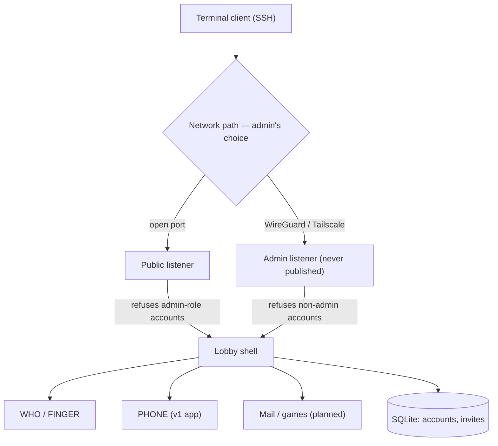
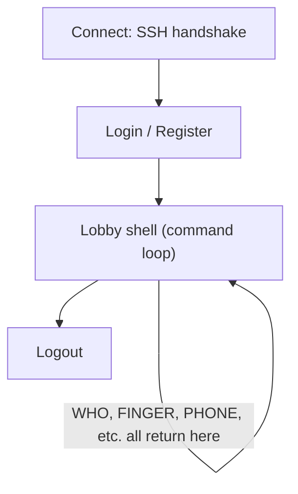
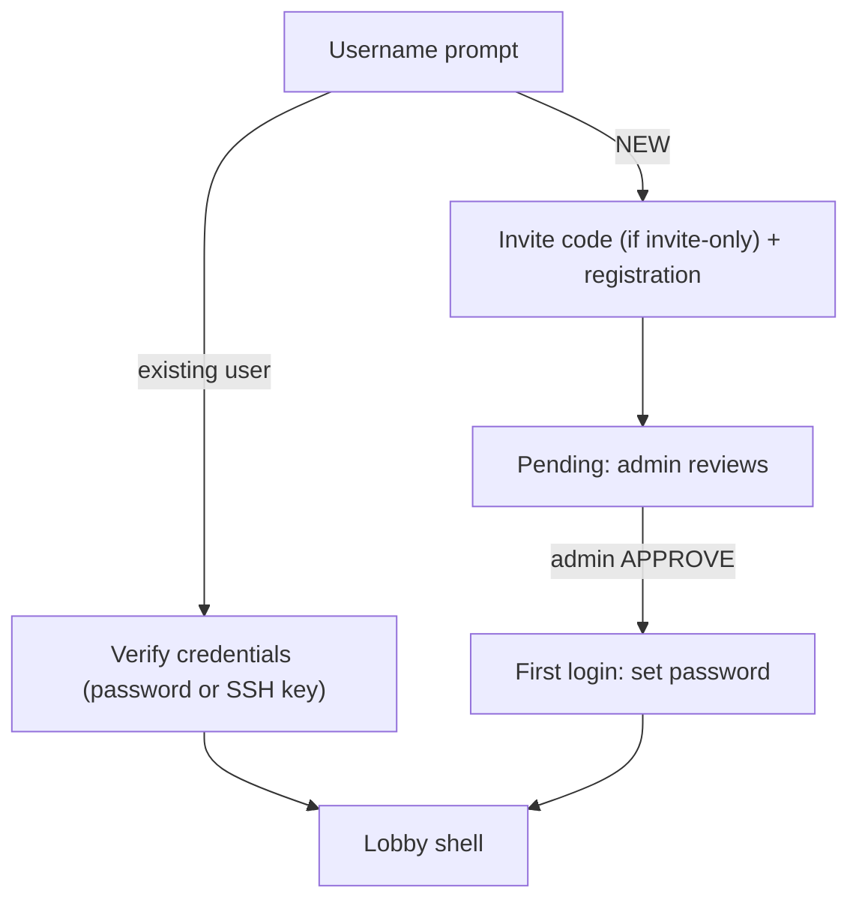

# Retro VAX-BBS — Design Doc

A modern, self-hosted, retro VAX/VMS-style multi-user environment. Not a replacement for `talk`/`ytalk` — those already exist. This is a closed-world shell environment in the spirit of early-90s campus VAX/VMS, with **PHONE** (real-time multi-party chat, à la the original VAX/VMS PHONE utility) as the flagship first app, built on a modular framework that can host future apps (mail, a text game, etc.).

> **Naming note:** this project is an independent, non-commercial hobby homage to VAX/VMS terminal culture. It is not affiliated with, endorsed by, or representing VMS Software, Inc. (VSI) or Hewlett Packard Enterprise (HPE), who develop and support the actively-maintained OpenVMS operating system today. See the README for the full disclaimer.

Designed with eventual public/community release in mind (stretch goal: Unraid Community Apps), so the architecture supports multiple deployment risk postures rather than assuming one trusted environment.

---

## Core design principles

1. **Closed command grammar.** User input can only ever resolve to a fixed set of pre-compiled, admin-approved command handlers. There is no `exec`, `eval`, or scripting hook anywhere in the path from user input to execution. This is a structural property of the architecture, not a runtime check — there is no path to a real OS shell to "break out" into.
2. **Per-session crash isolation.** Every command handler runs under `recover()`, so a bug or malicious input in one handler can't take down the server or anyone else's session.
3. **Secure by default, regardless of deployment.** Rate limiting and account lockout are always on, whether the operator runs this behind a VPN or on an open port.
4. **Network exposure and identity verification are orthogonal.** How the admin secures the network (WireGuard, Tailscale, open port) is entirely their call and irrelevant to the app. Registration mode and the admin/public listener split are the app-level controls.

---

## Tech stack

- **Go**, using Charm's **`wish`** (SSH application framework) + **`bubbletea`** (TUI) + **`lipgloss`** (styling).
- **SQLite** for persistence (accounts, invites) — single-binary friendly, no external DB dependency.

**Why this stack:**
- Bubble Tea consumes terminal resize events (`WindowSizeMsg`) natively — the thing that broke on the original VAX terminals is a solved problem here.
- SSH gives encrypted transport for free, without hand-rolled crypto.
- Go compiles to a single static binary → trivial, tiny Docker image → clean Unraid template later.
- Alternative considered: Python + `asyncio` + `Textual` — also viable, not chosen, worth revisiting only if Go proves too steep a climb.

---

## Architecture overview



**Two SSH listeners, symmetric partition by account role:**
- **Public listener** — whatever port the admin chooses to expose. Accepts connection attempts from anyone, but **flatly refuses authentication for any admin-role account**, before even checking the password. Same generic "invalid credentials" message either way — an attacker can never tell whether they guessed an admin password correctly, because right-password-wrong-listener and wrong-password look identical.
- **Admin listener** — never published to the internet. Reachable only via the admin's own VPN tunnel (WireGuard/Tailscale/etc. — entirely the admin's setup, outside the app's concern). Refuses authentication for any non-admin account, mirroring the public listener.

This is enforced by **network binding**, not by app-layer IP/CIDR string-matching — more robust, can't be fooled by misidentified client IPs behind a proxy, and maps cleanly onto how Unraid users already think about which container ports to publish.

*(A CIDR-allowlist approach — app checks connecting IP against an allowed range, downgrades to non-admin if it doesn't match — was considered as a lighter-weight alternative or a defense-in-depth complement, but the listener split is the primary, simpler mechanism.)*

---

## Session lifecycle



The lobby is a closed loop. Every command — including launching an "app" like PHONE — runs and then returns control to the lobby. Nothing exits sideways into a real shell.

---

## Modular app interface

Apps (PHONE first, mail and a text game planned) implement a common lifecycle contract, mirroring Bubble Tea's own model interface (init / update / render). The lobby pushes an app onto the screen when its command is typed; the app owns the screen until it exits; control returns to the lobby. Getting this interface contract right early matters more than how many apps exist on day one — it's what makes future apps cheap to add without touching lobby code.

---

## Account & registration

**Registration mode is a deploy-time config choice**, not hardcoded — supports different operator risk tolerances:
- `invite-only` — requires a code (see below)
- `open-with-approval` — anyone can request an account; no code needed; admin manually approves
- `closed` — admin creates every account directly; no self-service at all

**Registration flow:**



- **Invite codes** (when used): short, human-typeable (word-pair style, e.g. `tackle-otter-42`, not a hex string), multi-use, expiring, generated via an admin command (`INVITE CREATE --uses N --expires Nd`).
- New account → `pending` status → admin `APPROVE`/`REJECT` → first login sets password.
- Existing account → password (argon2id) or registered SSH public key.
- **SSH key upgrade (optional, opt-in):** `SET KEY` registers a public key against an account; future connections skip the password prompt entirely if the key matches. Off by default, available to anyone who wants it.

---

## Auth & credential security

- **Argon2id** password hashing. Rough starting params: ~64MB memory, 3 iterations — tune against actual deployment hardware later.
- **Per-account lockout** after 5 failed attempts; admin `UNLOCK` clears it early.
- **Per-IP connection/attempt rate limiting baked into the app itself** — self-contained, works identically regardless of deployment (Docker, bare metal, behind VPN, open port). Doesn't depend on host-level tooling.
- **fail2ban / OS-level firewall banning is optional, documented, not required.** The app speaks SSH directly (via `wish`), so there's no standard `sshd` auth log for fail2ban to read out of the box — an operator who wants that layer needs a custom filter pointed at the app's own structured log output. The app logs each auth failure (timestamp, source IP, attempted username) specifically so that path stays easy to bolt on.
- **No username enumeration** — auth failure messages are always generic, regardless of which part (username or password) was actually wrong.

---

## Admin model

- **Admin accounts are separate accounts from daily-use accounts** — not a role flag toggled on someone's everyday account. Least-privilege by construction.
- **Enforcement is the dual-listener split** (see Architecture) — structural, not app-logic IP matching.
- **Admin accounts are invisible by default** in both `WHO` (the browsable list) and `FINGER <user>` (a direct, targeted lookup) — hiding only from `WHO` and not `FINGER` would leak existence the moment someone guesses/knows the username, so both are covered.
  - **Exception:** admins are always visible to other admins.
  - **Opt-in:** an individual admin account can run `SET VISIBLE` to be discoverable (e.g., a sysop who wants people to know they're around to help). Not the typical case.
- **All admin actions are always logged** with the real account name — `APPROVE`, `REJECT`, `KICK`, `BAN`, `UNLOCK` — regardless of that account's visibility setting. Invisibility is about presence-browsing for regular users, not about accountability.

---

## Roles & account states

- **Roles:** `user`, `admin`
- **States:** `pending`, `active`, `suspended`

---

## Schema sketch (SQLite)

```sql
users (
  id INTEGER PRIMARY KEY,
  username TEXT UNIQUE NOT NULL,
  password_hash TEXT,            -- null until first login post-approval
  ssh_pubkey TEXT,                -- null until SET KEY
  status TEXT NOT NULL,           -- pending | active | suspended
  role TEXT NOT NULL DEFAULT 'user',
  plan_text TEXT,                 -- FINGER profile blurb
  color_opt_in BOOLEAN DEFAULT 0,
  admin_visible BOOLEAN DEFAULT 0, -- only meaningful when role = 'admin'
  failed_attempts INTEGER DEFAULT 0,
  locked_until DATETIME,
  created_at DATETIME,
  last_login_at DATETIME
);

invites (
  code TEXT PRIMARY KEY,
  created_by INTEGER REFERENCES users(id),
  uses_remaining INTEGER,
  expires_at DATETIME
);
```

---

## v1 command set (lobby)

`HELP`, `WHO`, `FINGER <user>`, `PHONE` (first app), `SET` (plan text, color opt-in, admin visibility), `PASSWORD`, `LOGOUT`, `NEW` (registration).

Admin-only: `APPROVE`, `REJECT`, `KICK`, `BAN`, `UNLOCK`, `INVITE CREATE`.

**Nice-to-have, low effort:** VAX/VMS-style command abbreviation — typing the shortest unambiguous prefix of a command works, just like classic DCL.

---

## PHONE — the v1 flagship app

- Verbs mirror the original: `DIAL`, `ANSWER`, `HANGUP`, `ADD` (multi-party).
- Split-pane, character-echo live chat — robust to terminal resize via Bubble Tea's `WindowSizeMsg`.
- **Color/emphasis (future, not v1):** opt-in on both ends — renders only if the sender opted in to send it *and* the receiver opted in to receive it. Never breaks the experience of someone who hasn't opted in.

---

## Deployment model

- **One codebase, one Docker image** — no separate "VPN version" vs. "open version."
- Admin chooses network exposure entirely independently of app config (registration mode + admin listener binding are the actual security knobs).
- **Stretch goal:** Unraid Community Apps template.
- Public-release readiness was a design input from the start — the registration-mode config and the admin-listener split are what make an open-port deployment defensible, not a fork of the codebase.

---

## Deferred / future features (explicitly not v1)

- Mail app (uses the modular app interface)
- Text adventure game (uses the modular app interface)
- ASCII color/emphasis terminal options (see PHONE section above — opt-in both ends, always optional)
- External notification hooks (webhook/ntfy-style "X is online" pings) — subscribe model, opt-in; reserve the hook point in the login/presence code path now even though not built
- CIDR-based admin IP allowlist, as a documented complement/alternative to the dual-listener split

---

*See the companion notes doc for open questions, unresolved details, and stretch-goal scoping not yet locked in.*
